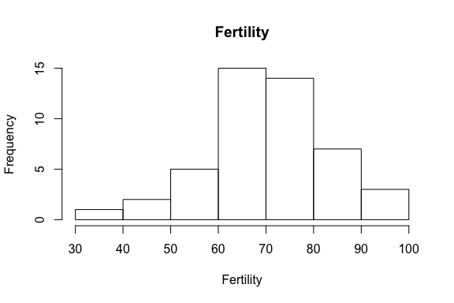
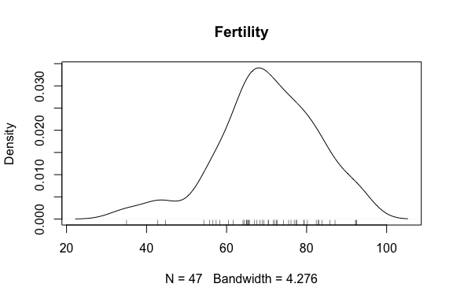
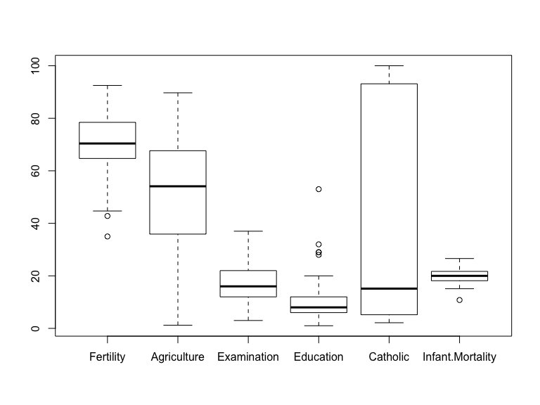
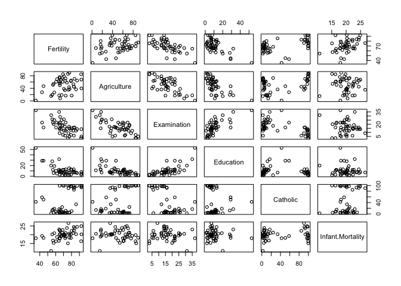
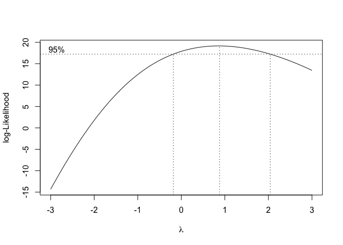
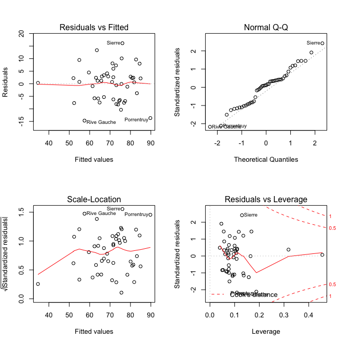
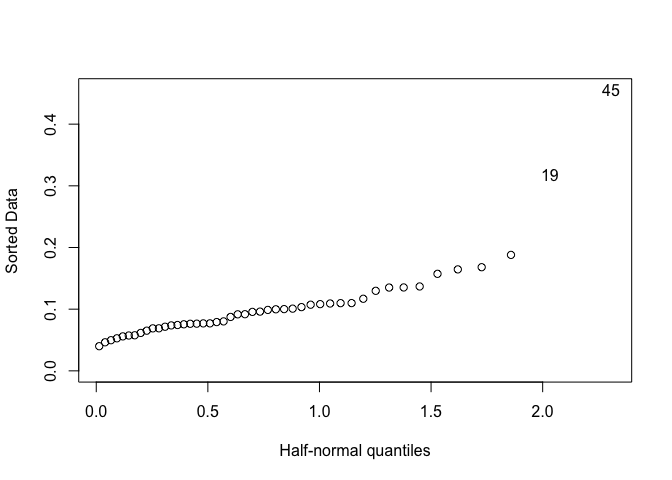
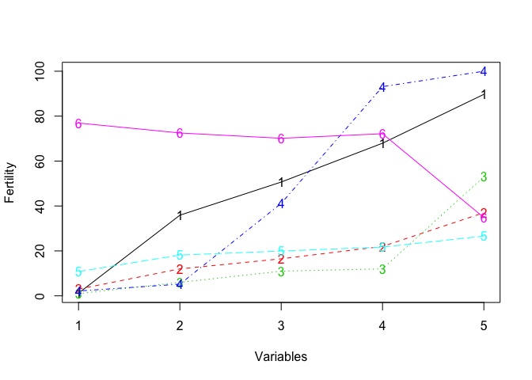

Objective
---------

The aim is to build some good linear models to analyze the `swiss` data where `Fertility` is used as the response.

Initial Data Analysis
---------------------

### Dataset Description

Standardized fertility measure and socio-economic indicators for each of 47 French-speaking provinces of Switzerland at about 1888.

### Dataset Format

A data frame with 47 observations on 6 variables, each of which is in percent, i.e., in \[0, 100\].

`[,1] Fertility` - Ig, ‘common standardized fertility measure’

`[,2] Agriculture` - % of males involved in agriculture as occupation

`[,3] Examination` - % draftees receiving highest mark on army examination

`[,4] Education` - % education beyond primary school for draftees.

`[,5] Catholic` - % ‘catholic’ (as opposed to ‘protestant’).

`[,6] Infant.Mortality` - live births who live less than 1 year.

All variables but ‘Fertility’ give proportions of the population.

### Analysis

``` r
# loading data
data(swiss)

# summary of data
summary(swiss)
```

    ##    Fertility      Agriculture     Examination      Education    
    ##  Min.   :35.00   Min.   : 1.20   Min.   : 3.00   Min.   : 1.00  
    ##  1st Qu.:64.70   1st Qu.:35.90   1st Qu.:12.00   1st Qu.: 6.00  
    ##  Median :70.40   Median :54.10   Median :16.00   Median : 8.00  
    ##  Mean   :70.14   Mean   :50.66   Mean   :16.49   Mean   :10.98  
    ##  3rd Qu.:78.45   3rd Qu.:67.65   3rd Qu.:22.00   3rd Qu.:12.00  
    ##  Max.   :92.50   Max.   :89.70   Max.   :37.00   Max.   :53.00  
    ##     Catholic       Infant.Mortality
    ##  Min.   :  2.150   Min.   :10.80   
    ##  1st Qu.:  5.195   1st Qu.:18.15   
    ##  Median : 15.140   Median :20.00   
    ##  Mean   : 41.144   Mean   :19.94   
    ##  3rd Qu.: 93.125   3rd Qu.:21.70   
    ##  Max.   :100.000   Max.   :26.60

#### 1. Distribution of response variable

``` r
# histogram plot
hist(swiss$Fertility,main="Fertility",xlab="Fertility")
```



``` r
# density plot
plot(density(swiss$Fertility),main="Fertility")
rug(swiss$Fertility)
```



-   Plot is little right skewed
-   Fertility rates are mostly between 60-90%

#### 2. Analyzing predictor variables

``` r
# boxplot analysis
boxplot(swiss)
```



-   `Catholic` variable covers wide range of values
-   `Infant.Mortality` variable is very condensed
-   `Education` seems to have some outliers

``` r
# correlation analysis
cor(swiss)
```

    ##                   Fertility Agriculture Examination   Education   Catholic
    ## Fertility         1.0000000  0.35307918  -0.6458827 -0.66378886  0.4636847
    ## Agriculture       0.3530792  1.00000000  -0.6865422 -0.63952252  0.4010951
    ## Examination      -0.6458827 -0.68654221   1.0000000  0.69841530 -0.5727418
    ## Education        -0.6637889 -0.63952252   0.6984153  1.00000000 -0.1538589
    ## Catholic          0.4636847  0.40109505  -0.5727418 -0.15385892  1.0000000
    ## Infant.Mortality  0.4165560 -0.06085861  -0.1140216 -0.09932185  0.1754959
    ##                  Infant.Mortality
    ## Fertility              0.41655603
    ## Agriculture           -0.06085861
    ## Examination           -0.11402160
    ## Education             -0.09932185
    ## Catholic               0.17549591
    ## Infant.Mortality       1.00000000

-   All correlations with `Fertility` are less than 0.8, indicating no signs of strong multicollinearity.
-   Correlations are betweeen 0.3-0.8, indicating mild multicollinearity.

``` r
# correlation analysis plot
pairs(swiss)
```



-   Plot shows linear relationship between `Agriculture` and `Examination`.
-   Also, between `Examination` and `Education`.
-   Interpretation of coefficients will be affected.

Fitting a linear Model
----------------------

``` r
# basic linear model with all variables
model <- lm(Fertility ~ Agriculture + Examination + Education + 
              Catholic + Infant.Mortality, swiss)
summary(model)
```

    ## 
    ## Call:
    ## lm(formula = Fertility ~ Agriculture + Examination + Education + 
    ##     Catholic + Infant.Mortality, data = swiss)
    ## 
    ## Residuals:
    ##      Min       1Q   Median       3Q      Max 
    ## -15.2743  -5.2617   0.5032   4.1198  15.3213 
    ## 
    ## Coefficients:
    ##                  Estimate Std. Error t value Pr(>|t|)    
    ## (Intercept)      66.91518   10.70604   6.250 1.91e-07 ***
    ## Agriculture      -0.17211    0.07030  -2.448  0.01873 *  
    ## Examination      -0.25801    0.25388  -1.016  0.31546    
    ## Education        -0.87094    0.18303  -4.758 2.43e-05 ***
    ## Catholic          0.10412    0.03526   2.953  0.00519 ** 
    ## Infant.Mortality  1.07705    0.38172   2.822  0.00734 ** 
    ## ---
    ## Signif. codes:  0 '***' 0.001 '**' 0.01 '*' 0.05 '.' 0.1 ' ' 1
    ## 
    ## Residual standard error: 7.165 on 41 degrees of freedom
    ## Multiple R-squared:  0.7067, Adjusted R-squared:  0.671 
    ## F-statistic: 19.76 on 5 and 41 DF,  p-value: 5.594e-10

Transformations
---------------

We can use box-cox transformation method to understand if response variable transformation is needed or not.

More Info: <https://www.statisticshowto.datasciencecentral.com/box-cox-transformation/>

``` r
# box-cox transformation for response variable
library(MASS)
box <- boxcox(
Fertility ~ Agriculture + Examination +Education+ Catholic +
Infant.Mortality, data = swiss,
lambda = seq(from = -3, to = 3, length = 50)
)
```



-   *λ*=1 lies in 95% confidence interval, so we can say that no transformation is needed for response variable.

Transformations of predictors can also be achieved - ?? Maybe polynomials ??

Variable Selection
------------------

``` r
# stepwise selection using AIC
model2 <- step(model,trace=FALSE)
model2
```

    ## 
    ## Call:
    ## lm(formula = Fertility ~ Agriculture + Education + Catholic + 
    ##     Infant.Mortality, data = swiss)
    ## 
    ## Coefficients:
    ##      (Intercept)       Agriculture         Education          Catholic  
    ##          62.1013           -0.1546           -0.9803            0.1247  
    ## Infant.Mortality  
    ##           1.0784

-   The final AIC of model achieved = 189.86
-   Final Model: `Fertility ~ Agriculture + Education + Catholic + Infant.Mortality`

``` r
# backward elimination using F-test
drop1(model,test='F')
```

    ## Single term deletions
    ## 
    ## Model:
    ## Fertility ~ Agriculture + Examination + Education + Catholic + 
    ##     Infant.Mortality
    ##                  Df Sum of Sq    RSS    AIC F value    Pr(>F)    
    ## <none>                        2105.0 190.69                      
    ## Agriculture       1    307.72 2412.8 195.10  5.9934  0.018727 *  
    ## Examination       1     53.03 2158.1 189.86  1.0328  0.315462    
    ## Education         1   1162.56 3267.6 209.36 22.6432 2.431e-05 ***
    ## Catholic          1    447.71 2552.8 197.75  8.7200  0.005190 ** 
    ## Infant.Mortality  1    408.75 2513.8 197.03  7.9612  0.007336 ** 
    ## ---
    ## Signif. codes:  0 '***' 0.001 '**' 0.01 '*' 0.05 '.' 0.1 ' ' 1

-   Backward elimination using F-test also suggest removal of `Examination` term as p-value is extremely large (0.315462 &gt; 0.05).
-   Final Model is same as selected using stepwise.

Diagnostics
-----------

``` r
# Basic diagnostic plots
par(mfrow=c(2,2))
plot(model2)
```



-   From residual plot, there is no pattern observed so constant variance assumption holds.

-   From QQ plot, we don't see heavy tails so normality assumption also holds.

-   Some extreme values are observed in cook's distance plot, indicating outliers and influential points in the data.

``` r
# top influential points
swiss[cooks.distance(model2) > 0.1,]
```

    ##             Fertility Agriculture Examination Education Catholic
    ## Porrentruy       76.1        35.3           9         7    90.57
    ## Sierre           92.2        84.6           3         3    99.46
    ## Rive Gauche      42.8        27.7          22        29    58.33
    ##             Infant.Mortality
    ## Porrentruy              26.6
    ## Sierre                  16.3
    ## Rive Gauche             19.3

``` r
# possible outliers
library(faraway)
halfnorm(influence(model2)$hat)
```



``` r
swiss[influence(model2)$hat>0.3,]
```

    ##              Fertility Agriculture Examination Education Catholic
    ## La Vallee         54.3        15.2          31        20     2.15
    ## V. De Geneve      35.0         1.2          37        53    42.34
    ##              Infant.Mortality
    ## La Vallee                10.8
    ## V. De Geneve             18.0

-   We can handle this by either removing outliers points from the dataset and then proceed with least squares.

-   We can also perform `robust regression` that downweights the effects of larger errors.

``` r
# Robust regression
library(MASS)
rlmodel <- rlm(Fertility ~ Agriculture + Examination + Education + 
              Catholic + Infant.Mortality, swiss)
summary(rlmodel)
```

    ## 
    ## Call: rlm(formula = Fertility ~ Agriculture + Examination + Education + 
    ##     Catholic + Infant.Mortality, data = swiss)
    ## Residuals:
    ##      Min       1Q   Median       3Q      Max 
    ## -16.0173  -5.0005   0.3231   4.0905  16.1854 
    ## 
    ## Coefficients:
    ##                  Value   Std. Error t value
    ## (Intercept)      65.4851 10.9074     6.0037
    ## Agriculture      -0.1933  0.0716    -2.6994
    ## Examination      -0.2869  0.2587    -1.1091
    ## Education        -0.8495  0.1865    -4.5558
    ## Catholic          0.1049  0.0359     2.9209
    ## Infant.Mortality  1.2184  0.3889     3.1330
    ## 
    ## Residual standard error: 6.633 on 41 degrees of freedom

Predictions
-----------

Suppose we assume following data for a particular region:

`[,2] Agriculture` - 70 % of males involved in agriculture as occupation

`[,3] Examination` - 20 % draftees receiving highest mark on army examination

`[,4] Education` - 30 % education beyond primary school for draftees.

`[,5] Catholic` - 10 % ‘catholic’ (as opposed to ‘protestant’).

`[,6] Infant.Mortality` - 28 live births who live less than 1 year

``` r
# input data
data <- data.frame(Agriculture=70,Examination=20,Education=30,
                   Catholic=10,Infant.Mortality=28)
# predict fertility rate for a region using full model
predict(model, newdata=data)
```

    ##        1 
    ## 54.77734

``` r
# predict fertility rate using stepwise model
predict(model2, newdata=data)
```

    ##        1 
    ## 53.31322

``` r
# predict fertility rate using robust regression model
predict(rlmodel, newdata=data)
```

    ##        1 
    ## 55.89241

Interpretation
--------------

Let's use `summary` statistics of different variables to get different values of predictions and then interpret results for `fertility`.

``` r
# input data
data <- data.frame(
  Agriculture=c(1.20,35.90,50.66,67.95,89.70),
  Examination=c(3,12,16.49,22,37),
  Education=c(1,6,10.98,12,53),
  Catholic=c(2.150,5.195,41.144,93.125,100),
  Infant.Mortality=c(10.80,18.15,19.94,21.70,26.60)
)
# using full model to get complete interpretation
data$pp <- predict(model,newdata=data)
matplot(data,type='o',ylab='Fertility',xlab='Variables')
```



Here:

-   `1-Agriculture`
-   `2-Examination`
-   `3-Education`
-   `4-Catholic`
-   `5-Infant.Mortality`
-   `6-Fertility`

Interpretation:

-   Fertility goes down as other predictor variables % increases
-   Fertility is highly affected by `Agriculture` and `Catholic` variables.
