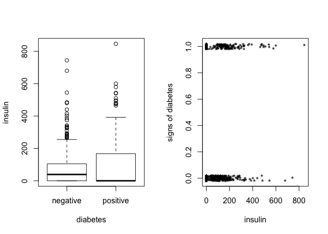
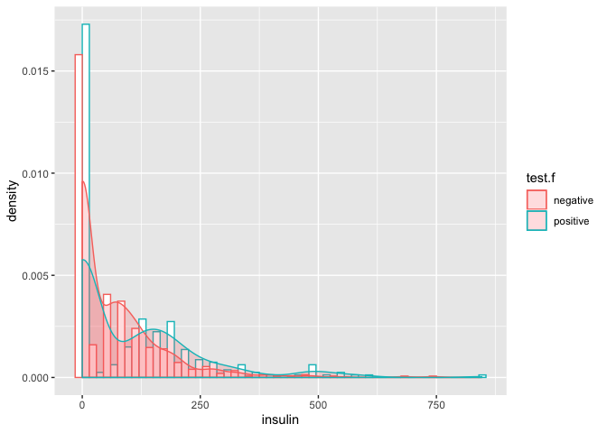
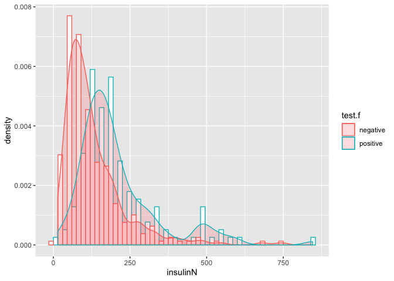
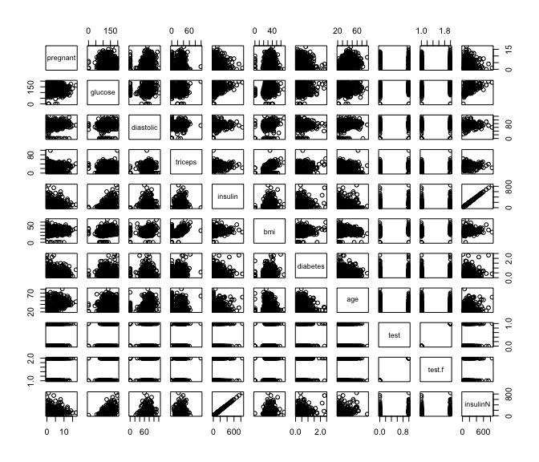
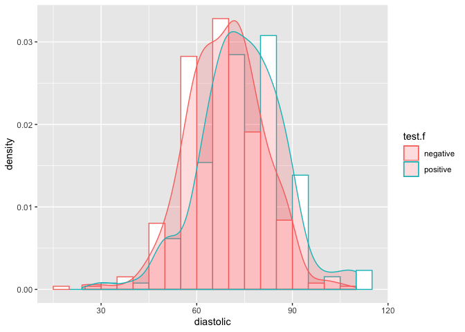

Objective
---------

The National Institute of Diabetes and Digestive and Kidney Diseases conducted a study on 768 adult female Pima Indians living near Phoenix. The purpose of the study was to investigate factors related to diabetes.

Dataset
-------

The data may be found in the the dataset `pima` in `faraway` package.

``` r
# loading dataset
library(faraway)
data(pima)
```

### Format

The dataset contains the following variables:

`pregnant` Number of times pregnant

`glucose` Plasma glucose concentration at 2 hours in an oral glucose tolerance test

`diastolic` Diastolic blood pressure (mm Hg)

`triceps` Triceps skin fold thickness (mm)

`insulin` 2-Hour serum insulin (mu U/ml)

`bmi` Body mass index (weight in kg/(height in metres squared))

`diabetes` Diabetes pedigree function

`age` Age (years)

`test` test whether the patient shows signs of diabetes (coded 0 if negative, 1 if positive)

Initial Data Analyis
--------------------

``` r
# dimensions of dataset
dim(pima)
```

    ## [1] 768   9

``` r
# top 5 rows
head(pima)
```

    ##   pregnant glucose diastolic triceps insulin  bmi diabetes age test
    ## 1        6     148        72      35       0 33.6    0.627  50    1
    ## 2        1      85        66      29       0 26.6    0.351  31    0
    ## 3        8     183        64       0       0 23.3    0.672  32    1
    ## 4        1      89        66      23      94 28.1    0.167  21    0
    ## 5        0     137        40      35     168 43.1    2.288  33    1
    ## 6        5     116        74       0       0 25.6    0.201  30    0

``` r
# summary of data
summary(pima)
```

    ##     pregnant         glucose        diastolic         triceps     
    ##  Min.   : 0.000   Min.   :  0.0   Min.   :  0.00   Min.   : 0.00  
    ##  1st Qu.: 1.000   1st Qu.: 99.0   1st Qu.: 62.00   1st Qu.: 0.00  
    ##  Median : 3.000   Median :117.0   Median : 72.00   Median :23.00  
    ##  Mean   : 3.845   Mean   :120.9   Mean   : 69.11   Mean   :20.54  
    ##  3rd Qu.: 6.000   3rd Qu.:140.2   3rd Qu.: 80.00   3rd Qu.:32.00  
    ##  Max.   :17.000   Max.   :199.0   Max.   :122.00   Max.   :99.00  
    ##     insulin           bmi           diabetes           age       
    ##  Min.   :  0.0   Min.   : 0.00   Min.   :0.0780   Min.   :21.00  
    ##  1st Qu.:  0.0   1st Qu.:27.30   1st Qu.:0.2437   1st Qu.:24.00  
    ##  Median : 30.5   Median :32.00   Median :0.3725   Median :29.00  
    ##  Mean   : 79.8   Mean   :31.99   Mean   :0.4719   Mean   :33.24  
    ##  3rd Qu.:127.2   3rd Qu.:36.60   3rd Qu.:0.6262   3rd Qu.:41.00  
    ##  Max.   :846.0   Max.   :67.10   Max.   :2.4200   Max.   :81.00  
    ##       test      
    ##  Min.   :0.000  
    ##  1st Qu.:0.000  
    ##  Median :0.000  
    ##  Mean   :0.349  
    ##  3rd Qu.:1.000  
    ##  Max.   :1.000

Task 1
------

Create a factor version of the test results and use this to produce an interleaved histogram to show how the distribution of `insulin` differs between those testing positive and negative. Do you notice anything unbelievable about the plot?

### Solution

``` r
# create a factor version of the test results
pima$test.f <- factor(pima$test)
levels(pima$test.f) <- c("negative","positive")

# plot insulin vs pima
par(mfrow=c(1,2))
plot(insulin ~ test.f, pima, xlab="diabetes")
plot(jitter(test,0.1)~jitter(insulin),pima,xlab="insulin",
     ylab="signs of diabetes",pch="*")
```



``` r
# interleaved histogram
library(ggplot2)
```

    ## Warning: package 'ggplot2' was built under R version 3.5.2

``` r
ggplot(pima, aes(x=insulin, y=..density.., color=test.f)) +
  geom_histogram(position='dodge',binwidth = 30, fill="white") + 
  geom_density(alpha=.2, fill="#FF6666") 
```



-   density/count of `insulin` zero is very high (unbelievable)

Task 2
------

Replace the zero values of `insulin` with the missing value code `NA`. Recreate the interleaved histogram plot and comment on the distribution.

### Solution

``` r
# replace values
pima$insulinN <- pima$insulin
pima$insulinN[pima$insulin==0] <- NA
summary(pima$insulinN)
```

    ##    Min. 1st Qu.  Median    Mean 3rd Qu.    Max.    NA's 
    ##   14.00   76.25  125.00  155.55  190.00  846.00     374

``` r
# recreate plot
ggplot(pima, aes(x=insulinN, y=..density.., color=test.f)) +
  geom_histogram(position='dodge',binwidth = 30, fill="white") + 
  geom_density(alpha=.2, fill="#FF6666") 
```

    ## Warning: Removed 374 rows containing non-finite values (stat_bin).

    ## Warning: Removed 374 rows containing non-finite values (stat_density).



-   Distribution of having diabetes 0(negative) and 1(positive) is not same, implying that `insulin` is having significant effect on `test` response variable.

Task 3
------

Replace the incredible zeroes in other variables with the missing value code. Fit a model with the result of the diabetes test as the response and all the other variables as predictors. How many observations were used in the model fitting? Why is this less than the number of observations in the data frame?

### Solution

``` r
# plotting all predictors
pairs(pima)
```



-   `glucose` value cannot be zero
-   `triceps` thickness cannot be zero
-   `diastolic` blood pressure cannot be zero
-   `bmi` of a person cannot be zero

``` r
# replacing incredible zero variables
pima$glucoseN <- pima$glucose
pima$glucoseN[pima$glucose==0] <- NA

pima$tricepsN <- pima$triceps
pima$tricepsN[pima$triceps==0] <- NA

pima$diastolicN <- pima$diastolic
pima$diastolicN[pima$diastolic==0] <- NA

pima$bmiN <- pima$bmi
pima$bmiN[pima$bmi==0] <- NA

summary(pima)
```

    ##     pregnant         glucose        diastolic         triceps     
    ##  Min.   : 0.000   Min.   :  0.0   Min.   :  0.00   Min.   : 0.00  
    ##  1st Qu.: 1.000   1st Qu.: 99.0   1st Qu.: 62.00   1st Qu.: 0.00  
    ##  Median : 3.000   Median :117.0   Median : 72.00   Median :23.00  
    ##  Mean   : 3.845   Mean   :120.9   Mean   : 69.11   Mean   :20.54  
    ##  3rd Qu.: 6.000   3rd Qu.:140.2   3rd Qu.: 80.00   3rd Qu.:32.00  
    ##  Max.   :17.000   Max.   :199.0   Max.   :122.00   Max.   :99.00  
    ##                                                                   
    ##     insulin           bmi           diabetes           age       
    ##  Min.   :  0.0   Min.   : 0.00   Min.   :0.0780   Min.   :21.00  
    ##  1st Qu.:  0.0   1st Qu.:27.30   1st Qu.:0.2437   1st Qu.:24.00  
    ##  Median : 30.5   Median :32.00   Median :0.3725   Median :29.00  
    ##  Mean   : 79.8   Mean   :31.99   Mean   :0.4719   Mean   :33.24  
    ##  3rd Qu.:127.2   3rd Qu.:36.60   3rd Qu.:0.6262   3rd Qu.:41.00  
    ##  Max.   :846.0   Max.   :67.10   Max.   :2.4200   Max.   :81.00  
    ##                                                                  
    ##       test            test.f       insulinN         glucoseN    
    ##  Min.   :0.000   negative:500   Min.   : 14.00   Min.   : 44.0  
    ##  1st Qu.:0.000   positive:268   1st Qu.: 76.25   1st Qu.: 99.0  
    ##  Median :0.000                  Median :125.00   Median :117.0  
    ##  Mean   :0.349                  Mean   :155.55   Mean   :121.7  
    ##  3rd Qu.:1.000                  3rd Qu.:190.00   3rd Qu.:141.0  
    ##  Max.   :1.000                  Max.   :846.00   Max.   :199.0  
    ##                                 NA's   :374      NA's   :5      
    ##     tricepsN       diastolicN          bmiN      
    ##  Min.   : 7.00   Min.   : 24.00   Min.   :18.20  
    ##  1st Qu.:22.00   1st Qu.: 64.00   1st Qu.:27.50  
    ##  Median :29.00   Median : 72.00   Median :32.30  
    ##  Mean   :29.15   Mean   : 72.41   Mean   :32.46  
    ##  3rd Qu.:36.00   3rd Qu.: 80.00   3rd Qu.:36.60  
    ##  Max.   :99.00   Max.   :122.00   Max.   :67.10  
    ##  NA's   :227     NA's   :35       NA's   :11

``` r
# fitting logistic model with logit link
modelNA <- glm(test ~ pregnant + glucoseN + diastolicN + tricepsN + insulinN + 
               bmiN + diabetes + age, family=binomial, pima)
summary(modelNA)
```

    ## 
    ## Call:
    ## glm(formula = test ~ pregnant + glucoseN + diastolicN + tricepsN + 
    ##     insulinN + bmiN + diabetes + age, family = binomial, data = pima)
    ## 
    ## Deviance Residuals: 
    ##     Min       1Q   Median       3Q      Max  
    ## -2.7823  -0.6603  -0.3642   0.6409   2.5612  
    ## 
    ## Coefficients:
    ##               Estimate Std. Error z value Pr(>|z|)    
    ## (Intercept) -1.004e+01  1.218e+00  -8.246  < 2e-16 ***
    ## pregnant     8.216e-02  5.543e-02   1.482  0.13825    
    ## glucoseN     3.827e-02  5.768e-03   6.635 3.24e-11 ***
    ## diastolicN  -1.420e-03  1.183e-02  -0.120  0.90446    
    ## tricepsN     1.122e-02  1.708e-02   0.657  0.51128    
    ## insulinN    -8.253e-04  1.306e-03  -0.632  0.52757    
    ## bmiN         7.054e-02  2.734e-02   2.580  0.00989 ** 
    ## diabetes     1.141e+00  4.274e-01   2.669  0.00760 ** 
    ## age          3.395e-02  1.838e-02   1.847  0.06474 .  
    ## ---
    ## Signif. codes:  0 '***' 0.001 '**' 0.01 '*' 0.05 '.' 0.1 ' ' 1
    ## 
    ## (Dispersion parameter for binomial family taken to be 1)
    ## 
    ##     Null deviance: 498.10  on 391  degrees of freedom
    ## Residual deviance: 344.02  on 383  degrees of freedom
    ##   (376 observations deleted due to missingness)
    ## AIC: 362.02
    ## 
    ## Number of Fisher Scoring iterations: 5

``` r
# number of observations used in the model fitting
nobs(modelNA)
```

    ## [1] 392

``` r
# total number of observations in the dataframe
dim(pima)[1]
```

    ## [1] 768

-   All the missing values (NA) observations are skipped while fitting the model

Task 4
------

Refit the model but now without the `insulin` and `triceps` predictors. How many observations were used in fitting this model? Devise a test to compare this model with that in the previous question.

### Solution

``` r
# refit model without insulin and triceps
model2NA <- glm(test ~ pregnant + glucoseN + diastolicN + 
               bmiN + diabetes + age, family=binomial, pima)

# number of observations used in the model fitting
nobs(model2NA)
```

    ## [1] 724

We can create a hypothesis test to check whether `insulin` and `triceps` are significant predictors or not.
$$
\\begin{aligned}
  H\_0: insulin=triceps=0 \\\\
  H\_1: insulin=triceps\\neq0 
\\end{aligned}
$$

``` r
# testing hypothesis using F-test
# omitting all NA observations
pimaN <- na.omit(pima)
dim(pimaN)
```

    ## [1] 392  15

``` r
# creating new models with same number of observations
modelNA1 <- glm(test ~ pregnant + glucoseN + diastolicN + tricepsN + insulinN + 
               bmiN + diabetes + age, family=binomial, pimaN)

modelNA2 <- glm(test ~ pregnant + glucoseN + diastolicN + 
               bmiN + diabetes + age, family=binomial, pimaN)

# anova F-test
anova(modelNA1, modelNA2, test='Chi')
```

    ## Analysis of Deviance Table
    ## 
    ## Model 1: test ~ pregnant + glucoseN + diastolicN + tricepsN + insulinN + 
    ##     bmiN + diabetes + age
    ## Model 2: test ~ pregnant + glucoseN + diastolicN + bmiN + diabetes + age
    ##   Resid. Df Resid. Dev Df Deviance Pr(>Chi)
    ## 1       383     344.02                     
    ## 2       385     344.88 -2 -0.85931   0.6507

-   p-value is greater than 5% significance level, implying we can reject alternate hypothesis thereby stating `insulin` and `triceps` predictors are not significant. Hence, model without these predictors is better.

Task 5
------

Use AIC to select a model. You will need to take account of the missing values. Which predictors are selected? How many cases are used in your selected model?

### Solution

``` r
# AIC model selection

# stepwise selection without any missing values model
step_model <- step(modelNA1, trace=FALSE)
summary(step_model)
```

    ## 
    ## Call:
    ## glm(formula = test ~ pregnant + glucoseN + bmiN + diabetes + 
    ##     age, family = binomial, data = pimaN)
    ## 
    ## Deviance Residuals: 
    ##     Min       1Q   Median       3Q      Max  
    ## -2.8827  -0.6535  -0.3694   0.6521   2.5814  
    ## 
    ## Coefficients:
    ##              Estimate Std. Error z value Pr(>|z|)    
    ## (Intercept) -9.992080   1.086866  -9.193  < 2e-16 ***
    ## pregnant     0.083953   0.055031   1.526 0.127117    
    ## glucoseN     0.036458   0.004978   7.324 2.41e-13 ***
    ## bmiN         0.078139   0.020605   3.792 0.000149 ***
    ## diabetes     1.150913   0.424242   2.713 0.006670 ** 
    ## age          0.034360   0.017810   1.929 0.053692 .  
    ## ---
    ## Signif. codes:  0 '***' 0.001 '**' 0.01 '*' 0.05 '.' 0.1 ' ' 1
    ## 
    ## (Dispersion parameter for binomial family taken to be 1)
    ## 
    ##     Null deviance: 498.10  on 391  degrees of freedom
    ## Residual deviance: 344.89  on 386  degrees of freedom
    ## AIC: 356.89
    ## 
    ## Number of Fisher Scoring iterations: 5

-   Again, `insulin` and `triceps` are not selected as significant predictors, implying correctness of our previous hypothesis.
-   `glucose`, `bmi`, `diabetes` and `age` are considered as significant predictors as per AIC.

Task 6
------

Create a variable that indicates whether the case contains a missing value. Use this variable as a predictor of the test result. Is missingness associated with the test result? Refit the selected model, but now using as much of the data as reasonable. Explain why it is appropriate to do this.

### Solution

``` r
# variable to indicate if there is some missing value
pima$missingCase <- apply(pima,1,anyNA)
xtabs(~test.f+missingCase,pima)
```

    ##           missingCase
    ## test.f     FALSE TRUE
    ##   negative   262  238
    ##   positive   130  138

``` r
# fitting model with missingness
modelMissingCases <- glm(test.f~missingCase, family=binomial,pima) 
summary(modelMissingCases)
```

    ## 
    ## Call:
    ## glm(formula = test.f ~ missingCase, family = binomial, data = pima)
    ## 
    ## Deviance Residuals: 
    ##     Min       1Q   Median       3Q      Max  
    ## -0.9564  -0.9564  -0.8977   1.4159   1.4857  
    ## 
    ## Coefficients:
    ##                 Estimate Std. Error z value Pr(>|z|)    
    ## (Intercept)      -0.7008     0.1073  -6.533 6.47e-11 ***
    ## missingCaseTRUE   0.1558     0.1515   1.028    0.304    
    ## ---
    ## Signif. codes:  0 '***' 0.001 '**' 0.01 '*' 0.05 '.' 0.1 ' ' 1
    ## 
    ## (Dispersion parameter for binomial family taken to be 1)
    ## 
    ##     Null deviance: 993.48  on 767  degrees of freedom
    ## Residual deviance: 992.43  on 766  degrees of freedom
    ## AIC: 996.43
    ## 
    ## Number of Fisher Scoring iterations: 4

We can check if missingness is associated with `test` result using hypothesis testing by checking whether `missingCase` parameter is significant or not.
$$
\\begin{aligned}
  H\_0: missingCase=0 \\\\
  H\_1: missingCase\\neq0 
\\end{aligned}
$$

``` r
# checking significance of missingCase parameter
anova(modelMissingCases,test="Chi")
```

    ## Analysis of Deviance Table
    ## 
    ## Model: binomial, link: logit
    ## 
    ## Response: test.f
    ## 
    ## Terms added sequentially (first to last)
    ## 
    ## 
    ##             Df Deviance Resid. Df Resid. Dev Pr(>Chi)
    ## NULL                          767     993.48         
    ## missingCase  1   1.0579       766     992.43   0.3037

-   p-value(0.3037) is greater than 5% significance level, implying alternate hypothesis can be rejected, thereby `missingCase` is not significant.
-   Hence, missingness is not associated with `test` results.

``` r
# re-fit selected model with pimaN dataset
# pimaN dataset is having no missing values
modelrs <- glm(test.f ~ pregnant + glucoseN + bmiN + diabetes + age,
                 family=binomial, pimaN)
summary(modelrs)
```

    ## 
    ## Call:
    ## glm(formula = test.f ~ pregnant + glucoseN + bmiN + diabetes + 
    ##     age, family = binomial, data = pimaN)
    ## 
    ## Deviance Residuals: 
    ##     Min       1Q   Median       3Q      Max  
    ## -2.8827  -0.6535  -0.3694   0.6521   2.5814  
    ## 
    ## Coefficients:
    ##              Estimate Std. Error z value Pr(>|z|)    
    ## (Intercept) -9.992080   1.086866  -9.193  < 2e-16 ***
    ## pregnant     0.083953   0.055031   1.526 0.127117    
    ## glucoseN     0.036458   0.004978   7.324 2.41e-13 ***
    ## bmiN         0.078139   0.020605   3.792 0.000149 ***
    ## diabetes     1.150913   0.424242   2.713 0.006670 ** 
    ## age          0.034360   0.017810   1.929 0.053692 .  
    ## ---
    ## Signif. codes:  0 '***' 0.001 '**' 0.01 '*' 0.05 '.' 0.1 ' ' 1
    ## 
    ## (Dispersion parameter for binomial family taken to be 1)
    ## 
    ##     Null deviance: 498.10  on 391  degrees of freedom
    ## Residual deviance: 344.89  on 386  degrees of freedom
    ## AIC: 356.89
    ## 
    ## Number of Fisher Scoring iterations: 5

-   we can use model by omitting all missing values (NA) since missingness is not having any significant effect on the `test` response variable.

Task 7
------

Using the last fitted model of the previous question, what is the difference in the log-odds of testing positive for diabetes for a woman with a BMI at the first quartile compared with a woman at the third quartile, assuming that all other factors are held constant? Then calculate the associated odds ratio value, and give a 95% confidence interval for this odds ratio.

### Solution

``` r
# BMI first and third quartile - using dataset with no missing values
summary(pimaN$bmiN)
```

    ##    Min. 1st Qu.  Median    Mean 3rd Qu.    Max. 
    ##   18.20   28.40   33.20   33.09   37.10   67.10

Log-odds are given as:
$$
o = \\frac{p}{1-p} \\Rightarrow p = \\frac{o}{1+o}
$$
 In terms of logit link, this can be written as:
$$
log \\frac{p\_i}{1-p\_i} = \\eta\_i \\Rightarrow log\\:o\_i=\\eta\_i
$$

Difference in log-odds for 1st and 3rd quartile can be given as:
*l**o**g* *o*<sub>1</sub> − *l**o**g* *o*<sub>3</sub> = *η*<sub>1</sub> − *η*<sub>3</sub>

``` r
# get quartiles
(bmi_1st_quartile = quantile(pimaN$bmiN,0.25))
```

    ##  25% 
    ## 28.4

``` r
(bmi_3rd_quartile = quantile(pimaN$bmiN,0.75))
```

    ##  75% 
    ## 37.1

``` r
# get bmi fitted value
(beta_bmi = coefficients(modelrs)['bmiN'])
```

    ##       bmiN 
    ## 0.07813866

``` r
# calculate eta keeping other factors constant
eta_1st_quartile = bmi_1st_quartile * beta_bmi
eta_3rd_quartile = bmi_3rd_quartile * beta_bmi

# difference in log odds for 1st and 3rd quartiles
(diff_log_odds = eta_1st_quartile - eta_3rd_quartile)
```

    ##        25% 
    ## -0.6798063

Odds-ratio is given as:
$$
\\frac{o\_1}{o\_3} = exp(log(\\frac{o\_1}{o\_3})) = exp(log\\:o\_1 - log\\:o\_3) = exp(\\eta\_1 - \\eta\_3)
$$

``` r
# log odds-ratio value
(exp(diff_log_odds))
```

    ##       25% 
    ## 0.5067151

We can calculate 95% confidence interval for bmi parameter as:
$$
\[\\hat{\\beta\_{bmi}}\\: \\pm \\: q\_{0.975}\*\\sqrt{I(\\beta\_{bmi})^{-1}}\]
$$

``` r
# calculate 95% confidence interval for bmi parameter
(conf_int_bmi = confint(modelrs,'bmiN'))
```

    ## Waiting for profiling to be done...

    ##      2.5 %     97.5 % 
    ## 0.03874896 0.11984439

``` r
# 95% confidence interval for log-odds ratio
(odds_ratio = (exp(conf_int_bmi * (bmi_1st_quartile - bmi_3rd_quartile))))
```

    ##     2.5 %    97.5 % 
    ## 0.7138261 0.3525206

``` r
# chance
(odds_ratio/(1+odds_ratio))
```

    ##     2.5 %    97.5 % 
    ## 0.4165102 0.2606397

-   So, keeping other parameters constant, odds of showing evidence of diabetes for a women with a BMI at the first quartile(28.4) are between `35 to 71 percent less` as compared to a women with a BMI at the third quartile(37.1)

Task 8
------

Do women who test positive have higher diastolic blood pressures? Is the diastolic blood pressure significant in the logistic regression model? Explain the distinction between the two questions and discuss why the answers are only apparently contradictory.

### Solution

``` r
# checking correlations of diastolic with other predictors
data(pima)
# removing rows
missing <- with(pima, missing <- glucose==0 | diastolic==0 | triceps==0 | bmi == 0) 
pima <- pima[!missing,]
cor(pima)['diastolic',]
```

    ##    pregnant     glucose   diastolic     triceps     insulin         bmi 
    ## 0.204663421 0.219177950 1.000000000 0.226072440 0.007051676 0.307356904 
    ##    diabetes         age        test 
    ## 0.008047249 0.346938723 0.183431874

-   Clearly, `diastolic` shows a positive correlation with `test` response variable.
-   Moreover, `diastolic` have positive correlation with other variables such as `glucose`, `bmi` and other predictors. So, `test` is more likely to be positive when `diastolic` is large as other predictors will also be large.

``` r
# interleaved histogram for diastolic
ggplot(pimaN, aes(x=diastolic, y=..density..,color=test.f)) +
  geom_histogram(position='dodge', fill='white', binwidth = 10) +
  geom_density(alpha=.2, fill="#FF6666")
```



-   On contrary, distribution for both negative and positive diabetes looks similar, implying that `diastolic` is not significant enough for `test` response variable.

``` r
# logistic model 
summary(modelNA)
```

    ## 
    ## Call:
    ## glm(formula = test ~ pregnant + glucoseN + diastolicN + tricepsN + 
    ##     insulinN + bmiN + diabetes + age, family = binomial, data = pima)
    ## 
    ## Deviance Residuals: 
    ##     Min       1Q   Median       3Q      Max  
    ## -2.7823  -0.6603  -0.3642   0.6409   2.5612  
    ## 
    ## Coefficients:
    ##               Estimate Std. Error z value Pr(>|z|)    
    ## (Intercept) -1.004e+01  1.218e+00  -8.246  < 2e-16 ***
    ## pregnant     8.216e-02  5.543e-02   1.482  0.13825    
    ## glucoseN     3.827e-02  5.768e-03   6.635 3.24e-11 ***
    ## diastolicN  -1.420e-03  1.183e-02  -0.120  0.90446    
    ## tricepsN     1.122e-02  1.708e-02   0.657  0.51128    
    ## insulinN    -8.253e-04  1.306e-03  -0.632  0.52757    
    ## bmiN         7.054e-02  2.734e-02   2.580  0.00989 ** 
    ## diabetes     1.141e+00  4.274e-01   2.669  0.00760 ** 
    ## age          3.395e-02  1.838e-02   1.847  0.06474 .  
    ## ---
    ## Signif. codes:  0 '***' 0.001 '**' 0.01 '*' 0.05 '.' 0.1 ' ' 1
    ## 
    ## (Dispersion parameter for binomial family taken to be 1)
    ## 
    ##     Null deviance: 498.10  on 391  degrees of freedom
    ## Residual deviance: 344.02  on 383  degrees of freedom
    ##   (376 observations deleted due to missingness)
    ## AIC: 362.02
    ## 
    ## Number of Fisher Scoring iterations: 5

-   This also supports our claim that `diastolic` is not significant in presence of other variables as p-value is very high at 5% significance level

Hence, answers appears to be contradictory.
